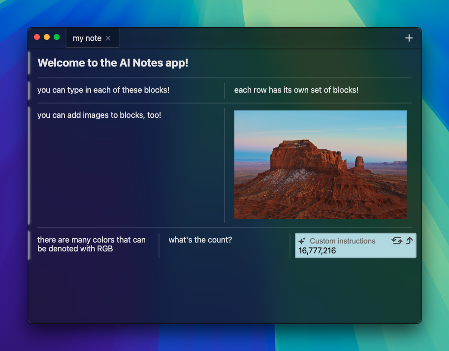

# AI Notes App

_This project is currently a work in progress. The app may behave in unexpected ways, and AI features are not yet complete._



## Overview

I've been wanting to experiment with making my own notes app, because I haven't been able to find a notes app that feels optimized for my own use cases and workflow. Inspired by [Raycast's](https://www.raycast.com/) floating notes window, I decided to create an app that borrows a stylistically similar design, while being a _lot_ more powerful.

This notes app is probably not the perfect solution. I've never made a notes app before, and this was my attempt at making a notes app that's simply _different_. I wanted to simply give it a try and see what I could come up with. I may iterate on this more in the future, based on my own observations of what I like and don't like about it.

Feedback and contributions are certainly welcome! It's not a perfect notes app, but I'd be interested to hear what works well and what doesn't.

## About the App

This app is built with Electron, React, and TypeScript.

Due to the complexities of building a WYSIWYG editor (and the fact that contenteditable does not play nice with React!), I knew I had to build a different type of editor. It has a few aspects that make it unique:

- **At the forefront.** Your windows ("notes") always stay floating in the foreground. This means it's easy to jot down thoughts, and you can quickly refer to them as needed.
- **Blocks.** Each note is split up into rows, called "block groups." Within each block group, up to 5 blocks can exist. A block is essentially a text box. This allows you to split up your note into distinct sections. You can combine related thoughts into a single block group, which makes it easier to send your thoughts to the AI.
- **AI**. _(Not yet implemented.)_ For people who regularly utilize LLMs (such as ChatGPT), opening a new browser tab/window to ask questions throughout the day can become frustrating. My goal is to minimize the time that it takes to ask those questions. GPT lives within this notes app, and you can easily send your block groups to GPT.

## Usage

Though I have not yet packaged the application, running the app is rather simple.

### Installation

_These instructions require that you have already installed [Git](https://git-scm.com/downloads) and [Node.js](https://nodejs.org/en/download/package-manager)._

```
git clone https://github.com/TechPandaPro/ai-notes-app.git
cd ai-notes-app
npm install
```

### Running the App

You can start the Electron app by running `npm start`. The AI Notes App should then open.
